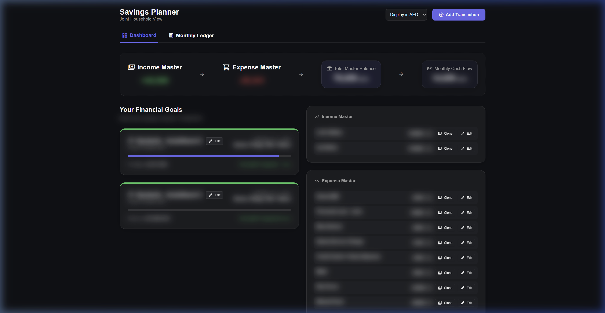

# Multi-Currency Savings Ledger



A robust, real-time financial tracking application powered by a FastAPI Python backend and a React (Vite) frontend. The application features a dynamic Goal Waterfall engine, chronological native Master Ledgers, and strict multi-currency algorithmic rounding to effectively track offline wealth accumulation.

## Current Capabilities

- track accounts, income, expenses, transfers, and goals
- view dashboard summaries and ledger history
- generate date-based savings forecasts for future targets
- switch between local SQLite and Supabase-backed persistence
- view connection and sync status directly in the app
- explore the repository through a generated Graphify knowledge graph

## Project Structure

This project uses a separated Frontend/Backend architecture:
- `backend/api/` - API app entry, HTTP routes, and request dependencies
- `backend/core/` - application settings and startup/bootstrap logic
- `backend/domain/` - SQLAlchemy models and DTO schemas
- `backend/infrastructure/` - database configuration and runtime persistence wiring
- `backend/services/` - forecast, dashboard, and sync business logic
- `frontend/` - React frontend powered by Vite
- `docs/` - architecture and development references

## Prerequisites

To run this application locally on your machine, you must have the following installed:
1. **Node.js**: `v18.0` or higher (to run the React Frontend)
2. **Python**: `v3.10` or higher (to run the FastAPI Backend)
3. **Git**: To clone the repository

---

## Local Setup & Run Instructions

### 1. Backend Setup

The backend serves as the SQL Engine and the mathematical core.

1. Open a terminal and navigate strictly to the root folder of this repository.
2. Create a virtual environment to isolate the Python packages:
   ```bash
   python -m venv .venv
   ```
3. Activate the virtual environment:
   - **Windows:** `.\.venv\Scripts\Activate.ps1`
   - **Mac/Linux:** `source .venv/bin/activate`
4. Install the required dependencies:
   ```bash
   pip install fastapi uvicorn sqlalchemy pydantic psycopg[binary] python-dotenv prophet
   ```
5. If you want to use Supabase instead of the local SQLite database, use [.env.example](.env.example) as a non-secret template only. Keep passwords out of source control and enter the final Supabase credentials or connection string locally or at runtime through the app Settings screen.
6. Boot the server using Uvicorn (this will run on port `8000`):
   ```bash
   uvicorn backend.api.app:app --port 8000 --reload
   ```

*(The backend must remain running in this terminal window).*

### Optional: sync your current SQLite data to Supabase

After adding your Supabase connection details, open the app Settings and enable Supabase or one-way sync.

If you prefer a manual command, run:

```bash
python -m backend.services.db_sync
```

This copies your existing local [savings.db](savings.db) records into Supabase/Postgres.

### 2. Frontend Setup

The frontend serves the UI/UX dashboard. Open a **brand new** secondary terminal window.

You can use either of these clone-friendly options:

#### Option A: run from the repository root

```bash
npm run frontend:install
npm run dev
```

#### Option B: run from inside the frontend folder

```bash
cd frontend
npm install
npm run dev
```

A localhost link (usually `http://localhost:5173/` or the next free port) will appear in your terminal. Click it to open your application.

### 3. Local quick start after cloning

Once dependencies are installed, the shortest local workflow is:

**Terminal 1**
```bash
npm run backend:dev
```

**Terminal 2**
```bash
npm run dev
```

This keeps local development working automatically through the Vite proxy to the FastAPI backend.

## Deploying for production

To make the app work on Netlify **and** continue to work locally after cloning, the repository now separates the deployment responsibilities clearly:

- Netlify hosts the React frontend using [netlify.toml](netlify.toml)
- the Python API should be hosted separately using [render.yaml](render.yaml), [Procfile](Procfile), and [requirements.txt](requirements.txt)
- Netlify should have the environment variable `VITE_API_BASE_URL` set to the public URL of the hosted backend
- once the backend is reachable, the Settings screen can safely switch the app to Supabase for persistent hosted data

### Recommended hosted setup

1. Deploy the backend to Render or Railway from this repository.
2. Start command should serve `backend.api.app:app` on the platform port.
3. Deploy the frontend to Netlify.
4. In Netlify environment variables, set `VITE_API_BASE_URL` to your backend URL, for example:

```bash
VITE_API_BASE_URL=https://your-backend-service.onrender.com
```

5. Redeploy the Netlify site.
6. Open Settings in the app and complete the Supabase connection details if you want hosted persistence.

## Graphify for New Contributors

If you are cloning this repository for the first time, Graphify is the fastest way to understand how the backend, frontend, forecasting, and database pieces connect.

### What it helps with

- visualize the structure of the codebase
- find the main modules and service boundaries quickly
- inspect readable community groups such as Forecasting Engine and Database & Supabase
- onboard faster before making changes

### Quick start after cloning

1. Open PowerShell in the repository root.
2. Make sure Python is available and the project virtual environment exists.
3. Run the helper:

```powershell
./scripts/graphify-dev.ps1
```

4. Open the generated outputs:
   - [graphify-out/graph.html](graphify-out/graph.html)
   - [graphify-out/GRAPH_REPORT.md](graphify-out/GRAPH_REPORT.md)
   - [graphify-out/graph.json](graphify-out/graph.json)

### How to use the graph

- use the search box to find a file, function, or concept
- click nodes to inspect their neighbors and source paths
- use the Communities panel to focus on one area at a time
- pause or resume the physics animation from the sidebar when needed

## Development Knowledge Graph

For architecture exploration and onboarding, this repository includes a Graphify helper workflow.

- Project guide: [docs/DevelopmentGraph.md](docs/DevelopmentGraph.md)
- Local graph output landing page: [graphify-out/README.md](graphify-out/README.md)
- Interactive graph: [graphify-out/graph.html](graphify-out/graph.html)
- Generated report: [graphify-out/GRAPH_REPORT.md](graphify-out/GRAPH_REPORT.md)
- Graph JSON: [graphify-out/graph.json](graphify-out/graph.json)
- PowerShell helper: [scripts/graphify-dev.ps1](scripts/graphify-dev.ps1)

## Disclaimer

The backend protects local data files and generated artifacts through [.gitignore](.gitignore). The SQLite database remains local to the machine unless you explicitly enable Supabase usage or sync.
